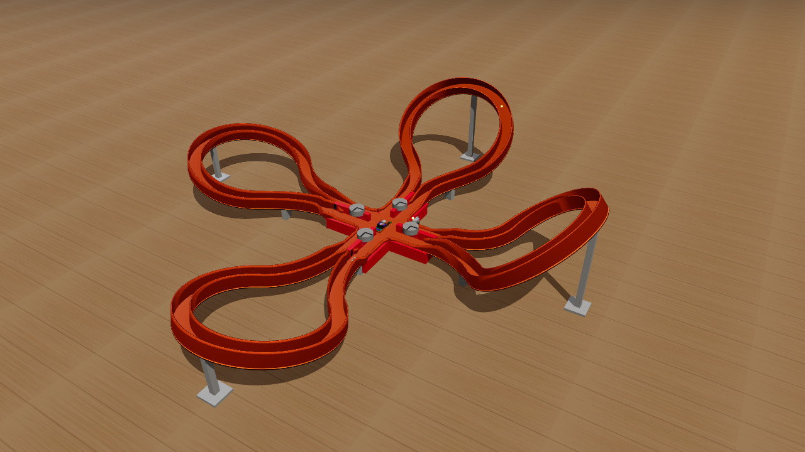

# Criss Cross Crash — a simulation

A browser simulation of the 2010 Hot Wheels **Criss Cross Crash** set (Mattel V2791): a red
motorised hub, four foam booster wheels, four track lobes and a `#` crossing where two independent
circuits cut across each other. It runs the 1999 Criss Cross Crash five-pack of castings
(#21081) — Porsche 959, Aeroflash, Ford GT-90, Chevy Stocker, Chevy 1500.

The physics is **modelled, not faked**. Four D cells with real internal resistance drive a
280-class brushed DC motor through a gear train to four foam wheels; each foam nip grips a car
with `mu·N` over a finite contact length and loads the drivetrain back, so the motor bogs when
several cars launch at once — exactly as the real toy does. Cars are rigid bodies with per-casting
mass and dimensions, rolling resistance from their wheel type, and they corner by leaning on the
track walls. Nothing is scripted onto a rail.



---

## Running it

No bundler, no build step, no install.

```bash
node tools/serve.mjs          # -> http://localhost:8765/
```

A single-file build, and the same page without the document wrapper for embedding:

```bash
node tools/build.mjs          # -> dist/index.html  and  dist/artifact.html
```

Automated checks (open the URL it prints; they run in the page):

```bash
node tools/selftest.mjs
```

Every tunable lives in `src/10-config.js` and the page's tuning drawer binds straight to it.
You can also pin a configuration in the URL, which survives a cold load — this is the real
2 rings + 2 sweeps shape the instruction sheet shows:

```
http://localhost:8765/index.html#cfg=%7B%22loopTiltDeg%22%3A48%2C%22sweepTiltDeg%22%3A16%7D
```

## How it is put together

Plain classic scripts, each an IIFE adding to `window.HW`, listed in load order in
`src/manifest.json`. Units are **cgs** throughout (cm, g, s, dyne); SI motor constants are
converted at the boundary. Y is up, +X east, +Z south, and a car's local forward is −Z.

| file | what it owns |
|---|---|
| `10-config.js` | every tunable number, with the measurement behind it in the comment |
| `30-track-layout.js` | lane geometry — the lobe solve, closure, boosters, gates |
| `31-track-mesh.js` | ribbon and wall meshes, used as both colliders and visuals |
| `40-electrical.js` | battery, motor, gear train |
| `41-booster.js` | the foam nip contact model |
| `42-vehicle.js` / `44-wheel-model.js` | the car; three interchangeable vehicle models |
| `43-sim.js` | Rapier world, fixed-step loop, events |
| `50/51-render-*.js` | scene, hub, gear-train x-ray, castings and liveries |
| `60-ui.js` | control panel, gauges, placement, tuning drawer |

`docs/SPEC.md` is the design; `docs/RESEARCH.md` and `docs/REFERENCES.md` are the grounding
facts, with every line tagged MEASURED / OBSERVED / REPORTED / ESTIMATE. `HANDOFF.md` is the
live state and is the file to read first.

### The lobes are tilted circles

The set's instruction sheet lists **4 × one moulded ~270° arc** and **4 × one adjustable track
support**, so all four lobes are the same part and only the tilt differs. Each lobe is therefore a
flat circle **tilted out of the horizontal** about the chord through its two ends — a
wall-of-death ring, not a loop-the-loop. A tilted circle projects to an ellipse in plan, which is
why the steep rear lobes have a small footprint and the shallow front ones a large one, and why
the whole set fits in about 110 cm. Everything else — junction radius, hub-to-chord gap, chord
height, plan splay — is derived, so the geometry cannot drift out of closure.

## Measuring it

This project is **chaotic at the run level**: `node tools/chaos.mjs` shows a 0.02 mm change in
starting position swinging a car's speed at a fixed point from 78 to 210 cm/s, and its lap count
from 0 to 1. No single run means anything. Everything is judged on ensembles.

| tool | question it answers |
|---|---|
| `tools/ens.mjs` | does this config lap? (5 castings × N start offsets) |
| `tools/energy.mjs` | where does the energy go? drag per 10 cm, gravity removed |
| `tools/coast.mjs` | how much drag really? motor off, deterministic |
| `tools/attribute.mjs` | what is taking it? splits the loss by wall / wheels-up / clean |
| `tools/diag.mjs` | what hit the car? contact manifolds with normals and impulses |
| `tools/audit.mjs` | static geometry audit: exposed wall caps, gaps, surface warp |
| `tools/geom.mjs` | the derived lobe geometry and a height/lean/curvature profile |

The headless harness needs Rapier vendored once: `node tools/fetch-rapier.mjs`.

## Where it stands

A lone car completes **1–3 laps** and then stalls. The selftest passes 8/8 in Chrome; the
five-car pile-up produces 5–10 crashes with four of five cars lapping. The real toy circulates
indefinitely, so this is not finished.

What is known about why, all measured rather than argued:

- It is **not** the physics engine's vehicle controller. A hand-written replacement
  (`vehicleMode: 'springs'`) loses the same.
- It is **not** surface warp, and **not** the lack of a banked channel — banking helps a coasting
  car and hurts a lapping one, because a bank only carries the corner above a speed the car does
  not hold for most of the lobe.
- The nip sits at a **two-sided maximum**: both a stronger and a weaker launch make it worse.
- The four nips are **paired** — two per hub, 17 cm apart, then a 131 cm coast around a whole
  lobe — and the second nip *brakes* a car the first made faster than the sagging foam surface,
  at a measured 2.47 g.
- Cars corner by **skidding**: the wheels can supply about 0.1 g of lateral force against a 3.5 g
  demand, so the wall does the aiming and charges for it.

`HANDOFF.md` carries the full record, including the dead ends with their numbers, so nobody
re-runs them.

## Progress

`docs/progress/` is a dated timeline — one image per milestone, each with what the sim could
actually *do* at that point. Start at
[`docs/progress/README.md`](docs/progress/README.md).

## Credits

Built with [Claude Code](https://claude.com/claude-code). Three.js r185 and Rapier 0.20 from
jsDelivr; no other dependencies. Hot Wheels and Criss Cross Crash are trademarks of Mattel — this
is an unaffiliated simulation built for the fun of modelling it.
