# Lukewarm Wheels

**Orange plastic track, taken far too seriously.** A die-cast toy car track simulator that runs in
your browser: four D cells drive a motor, the motor spins foam booster wheels, the wheels fling
1:64 cars through loops, jumps, a drag strip and a kitchen table, and every crash is worked out by
a physics engine. Nothing is scripted.

**▶ Play it: [lukewarm-wheels.pages.dev/play](https://lukewarm-wheels.pages.dev/play/)** ·
[Project page](https://lukewarm-wheels.pages.dev) · v1.0 · free, no install, desktop or phone

<a href="https://lukewarm-wheels.pages.dev/play/">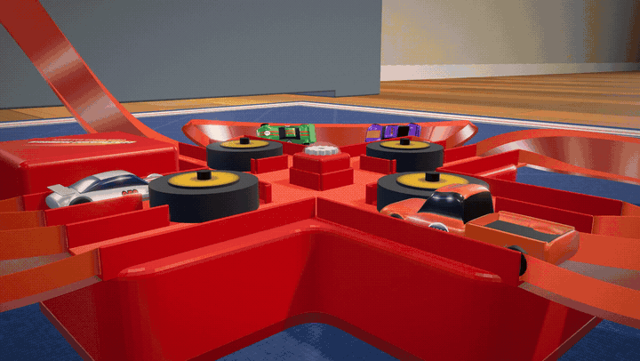</a>

*Real footage: the finished sim, filmed frame by frame at 60 fps by [`tools/film.mjs`](tools/film.mjs). Nobody animated a single crash.*

---

## What it looks like

<table>
<tr>
<td width="50%">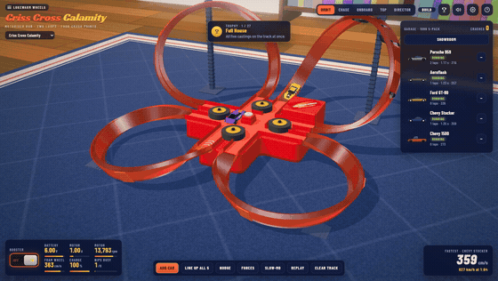</td>
<td width="50%">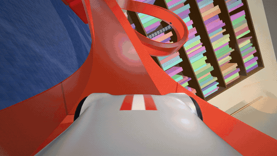</td>
</tr>
<tr>
<td><b>The crossing.</b> Four lanes cross in a <code>#</code>. The boosters keep cars in step until uneven foam lets them drift into each other.</td>
<td><b>Onboard.</b> Over the top of a loop the track can only push; speed is the only thing holding the car on.</td>
</tr>
<tr>
<td>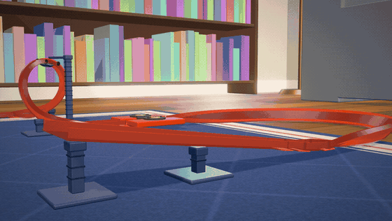</td>
<td>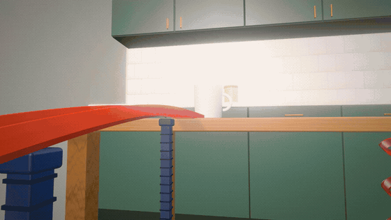</td>
</tr>
<tr>
<td><b>Loop &amp; Leap.</b> A spring launcher, a double loop and a gap. Off the lip, a car is a free rigid body until it lands.</td>
<td><b>Kitchen Table Grand Prix.</b> Down the table leg, through a box, over the books, under a chair and back up.</td>
</tr>
<tr>
<td>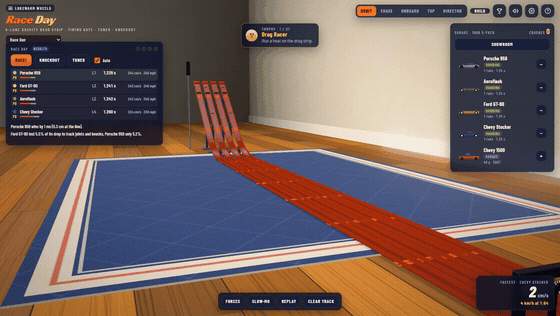</td>
<td>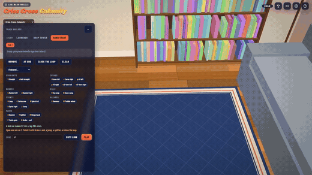</td>
</tr>
<tr>
<td><b>Race Day.</b> Gravity drag racing with a card that explains, from each car's energy ledger, why the winner won.</td>
<td><b>Track Builder.</b> Snap pieces together; a car test-drives it after every edit; the letters are the share link.</td>
</tr>
</table>

<table>
<tr>
<td>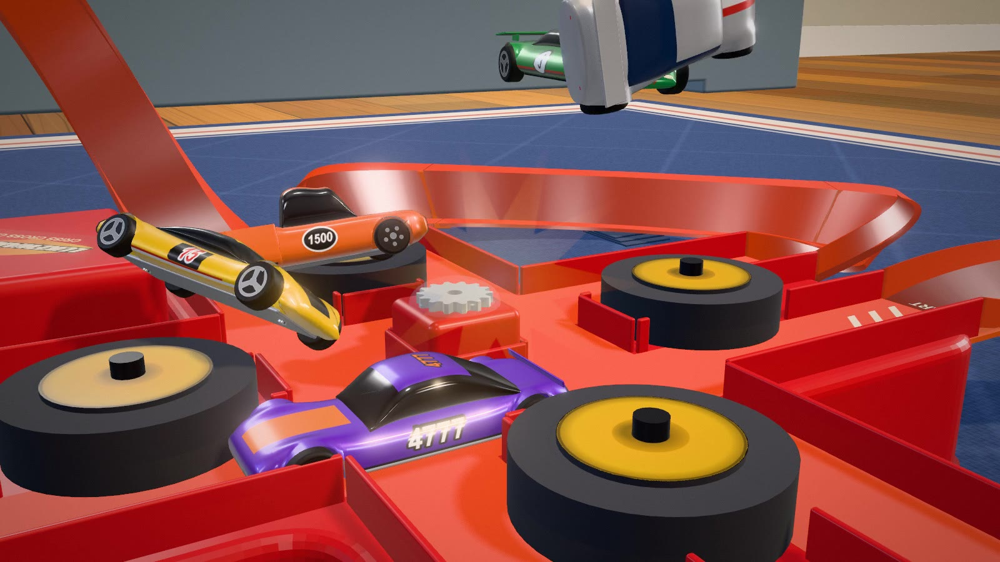</td>
<td>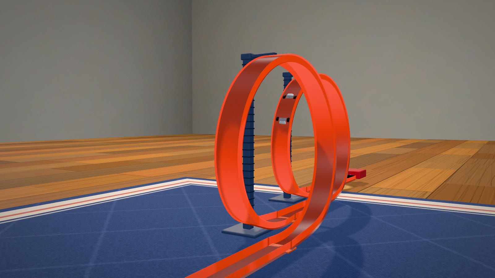</td>
<td>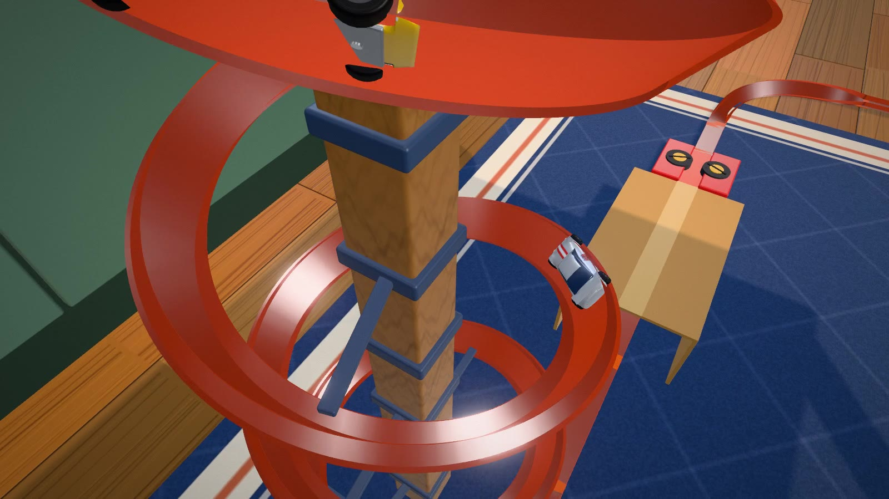</td>
</tr>
<tr>
<td>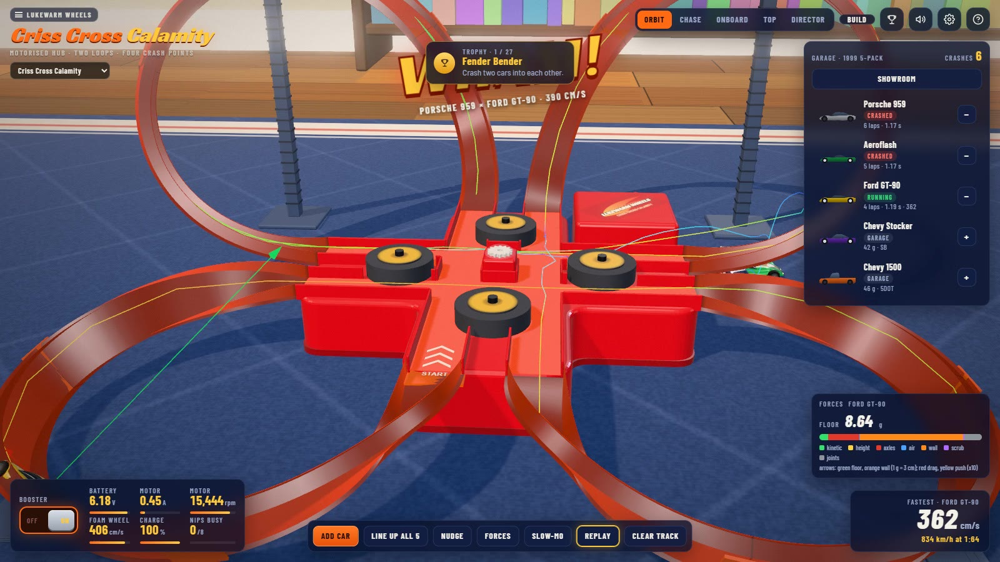</td>
<td>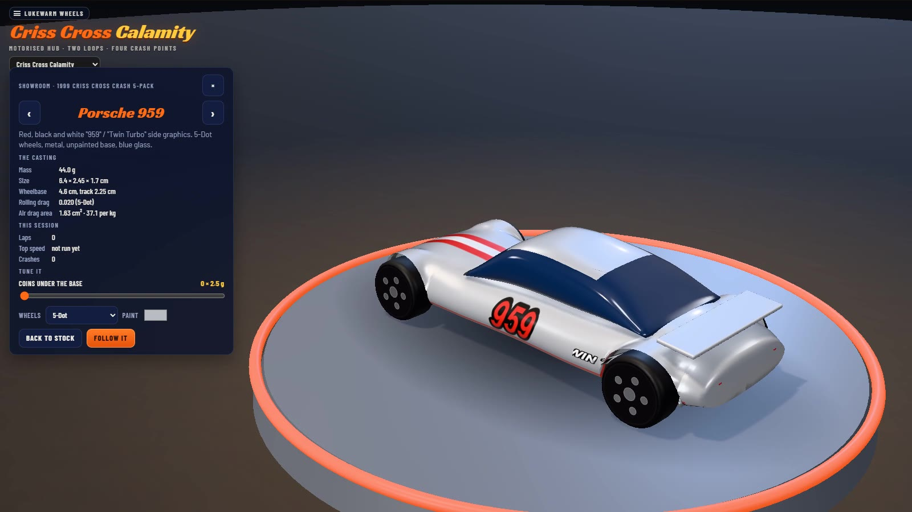</td>
<td>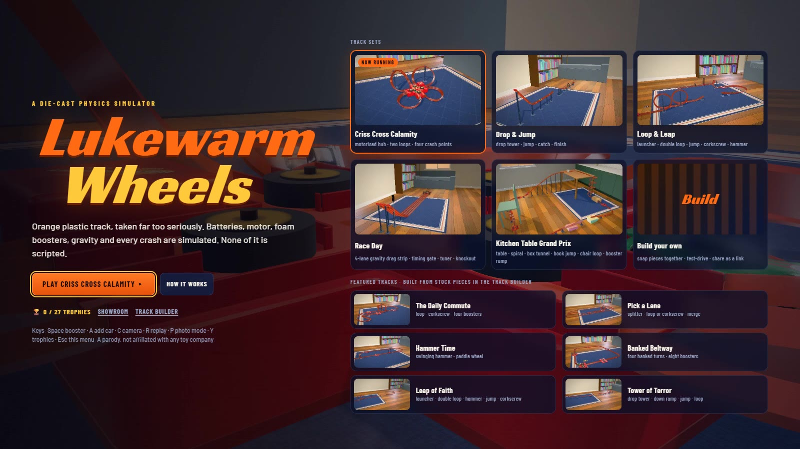</td>
</tr>
</table>

## The tracks

| | what it is |
|---|---|
| **Criss Cross Calamity** | A motorised hub, four foam booster wheels, two tall loops, two banked sweeps and a `#` crossing with four crash points. Modelled on the 2010 Criss Cross Crash set (Mattel V2791) and the 1999 five-pack of the same name. |
| **Drop & Jump** | The smallest proof of the engine: drop tower, kicker, free flight, catch ramp. |
| **Loop & Leap** | Spring launcher, double loop, jump and funnel catch, two-wheel booster, corkscrew, swinging hammer. |
| **Race Day** | A four-lane gravity drag strip with a timing gate, a tuner (coins, wheels, paint), knockouts and a why-it-won card. |
| **Kitchen Table Grand Prix** | Our own set: a spiral down a table leg, a box tunnel, a book jump, a chair loop and a boosted ramp home. With a challenge. |
| **Six featured tracks** | Built from stock pieces in the Track Builder: *The Daily Commute*, *Pick a Lane*, *Hammer Time*, *Banked Beltway*, *Leap of Faith*, *Tower of Terror*. |
| **Yours** | The Track Builder. A track is a string of letters and rides in the link: [`#t.PSBOSBllSBCSBll~`](https://lukewarm-wheels.pages.dev/play/#t.PSBOSBllSBCSBll~) |

## What is simulated

- **The power train.** Four D cells with internal resistance that rises as they drain, a brushed
  DC motor with back-EMF, a gear train, and four foam wheels on one flywheel. Every launch loads
  the same motor, so several cars in the nips at once bog it, and the gauges show it.
- **The boosters.** Each foam wheel sits between two lanes and pinches passing cars against the
  far wall: a squeeze force from how much wider the car is than the gap, and a drive force from
  foam friction that saturates with slip. Wider castings get a harder shove.
- **The cars on the track.** Each car is a mass constrained to the banked track surface,
  integrated at 1920 Hz: gravity, the centripetal demand of every curve, a floor and walls that
  can only push, rolling resistance per wheel type, wall scrub, tyre side-slip and air drag. Too
  slow over a loop top and the floor stops pushing: the car falls off.
- **Crashes and jumps.** Cars collide as rigid boxes with restitution and friction. A hard hit, a
  fall or a jump lip hands the car to [Rapier](https://rapier.rs), a full rigid-body engine,
  where it tumbles until it lands upright and moving in a lane (and is caught) or lies still
  (and a hand carries it back). A car leaving a lip rides on until its rear axle leaves, then
  flies with the pitch rate it got from pivoting off the edge.
- **The track.** Curves are joined for continuous curvature, loops and corkscrews are exact
  helices eased in by matching curves, and banking follows the heartline rule roller-coaster
  designers use.
- **Racing.** On the drag strip gravity is the only drive, so mass, wheels and frontal area
  decide it, and every car keeps an energy ledger that explains the result.
- **Imperfection, on purpose.** Track joints clack, every car's wheels drag a little
  differently, worn foam grips each pass at a slightly different speed. Without it, the boosters
  lock the cars in step and they never meet. With it, crashes come "eventually", the way people
  describe the real toy.

## Playing

| key | does |
|---|---|
| **Space** | booster on / off |
| **A** / **L** | drop the next car in / line up all five (the pile-up) |
| **1**-**5** | follow a car (or click it) |
| **C** | camera: Orbit, Chase, Onboard, Top, Director (it cuts to slow-motion crash and jump cams) |
| **R** / **S** | replay the last crash or jump / slow motion |
| **O** | the force overlay: floor, wall and booster forces drawn on every car |
| **F** / **G** | fire the launcher (Loop & Leap) / race (Race Day) |
| **V** | the Showroom: each casting on a turning plinth, with its numbers and the tuner |
| **P** | photo mode: hide the HUD, freeze time, save a PNG |
| **Y** | trophies: 27 of them, from *Fender Bender* to *Knockout Champion* |
| **T** / **H** / **Esc** | tuning drawer (battery, motor, foam grip, friction, joints, time) / help / the menu |

## Run it yourself

No build step for development: plain scripts, three.js and Rapier from a CDN.

| command | what it does |
|---|---|
| `node tools/serve.mjs` | the dev server: http://localhost:8765/ (`#s.loopLeap`, `#t.<code>` pick a track) |
| `node tools/build.mjs` | one self-contained file: `dist/index.html` (and `dist/artifact.html`) |
| `node tools/regress.mjs` | replays 13 scenarios and checks every car's state bit for bit against a saved baseline |
| `node tools/simtest.mjs <mode>` | headless physics: `lone`, `fleet`, `sweep`, `auto`, `race`, `code <track code>`, `challenge`, ... |
| `npm install` then `npm run film` | films every scene at 60 fps into `media/raw/` (Playwright + ffmpeg) |
| `npm run media` | cuts the footage into the site clips, the hero reel and these README GIFs |
| `npm run site` / `npm run deploy` | builds `site-dist/` (landing page at `/`, the sim at `/play/`) / publishes it to Cloudflare Pages |

## How it is put together

A set is plain data (`src/35-sets.js`), built by one generic builder into a graph of tracks:
each closed or open, and an open end is data too (a buffer, a jump lip, a link, a splitter). A
car in the channel has a position along its track, an offset across it and a height above it,
and is integrated there; leaving the channel hands it to Rapier (`src/43-freebody.js`), and a
free car that lands upright and moving in any track's lane is recaptured. Plain scripts in `src/`
each add to `window.HW` in the order of `src/manifest.json`; files `00` to `49` are the physics
and run headless in Node for the tests, `50` and up are rendering, sound and the interface.
Units are centimetres, grams and seconds. `HANDOFF.md` is the living state of the project,
including every design decision and why.

## How it was made

Built with [Claude Code](https://claude.com/claude-code) between 8 and 26 September 2026,
directed by one person who knows what the toy is supposed to do. The first version ran every car
as a free rigid body and never held a loop; after five sessions it was archived (`legacy/`) and
version two held each car to the track instead. The build is told frame by frame in
[`docs/progress/`](docs/progress/):

| | | |
|---|---|---|
| 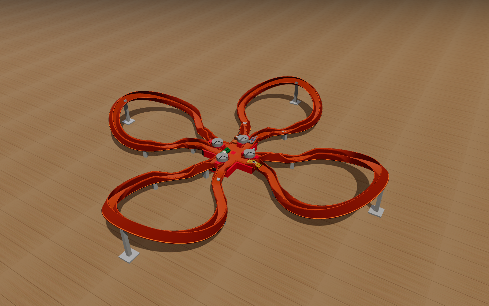 **Sep 8** · first render, wrong geometry | 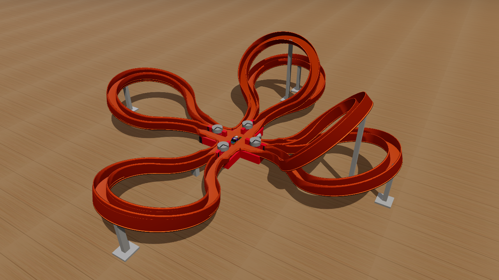 **Sep 8** · the real shape; it did not lap | 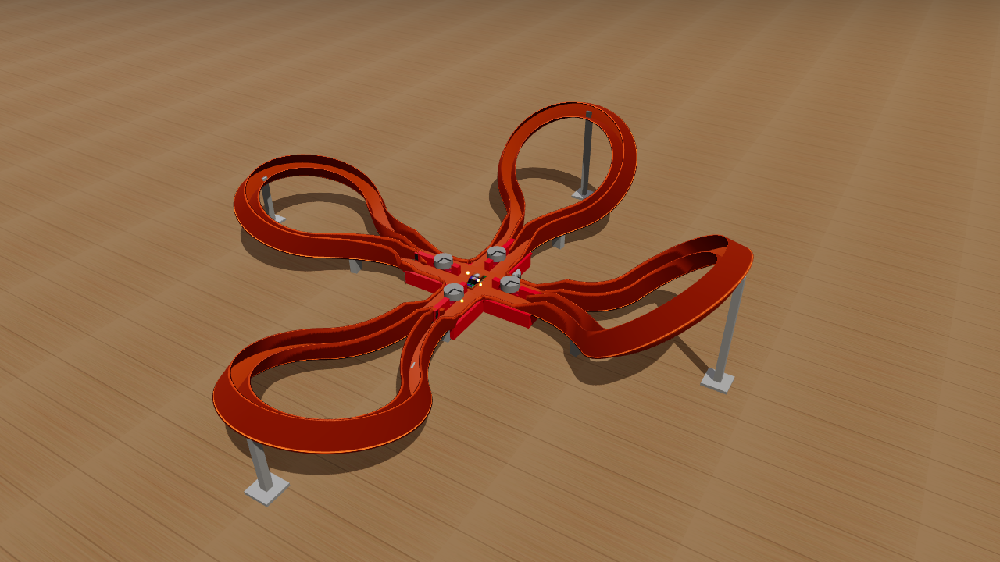 **Sep 13** · lobes become loops |
|  **Sep 24** · v2: over the top |  **Sep 24** · Loop & Leap |  **Sep 24** · Kitchen Table GP |

## Honesty about the numbers

The track width (31.75 mm), the four D cells and the layout come from the real set's instruction
sheet; the car colours, tampos and wheels from the collectors' wiki. Car masses, motor constants,
foam stiffness, wall friction and the loop shapes are engineering estimates, tagged `[E]` in
`src/10-config.js`, next to the measured `[M]` and derived `[D]` values.

## Footage

Every clip, GIF and still here and on the project page comes from the sim itself.
`tools/film.mjs` loads each scene in Chromium, swaps the page's clock for a virtual one
(`requestAnimationFrame`, `performance.now` and timers only move when the script steps a frame),
captures every frame and pipes it into ffmpeg at 60 fps, so the footage is smooth however slowly
it was captured. `tools/media.mjs` cuts it.

## Credits and the fine print

Built with [Claude Code](https://claude.com/claude-code). Rendering by [three.js](https://threejs.org),
free-body physics by [Rapier](https://rapier.rs). Sound effects partly generated with ElevenLabs.

**Lukewarm Wheels is a fan-made parody and a physics study.** It is not affiliated with, endorsed
by or connected to Mattel or any toy company. Hot Wheels and Criss Cross Crash are trademarks of
Mattel, named here only to credit the set this models. Car names describe the real vehicles the
toys depict.

**Licence:** [MIT](LICENSE). Fork it, remix it, build your own sets. The MIT licence covers the
code and the footage here; it grants no rights to anyone's trademarks.
