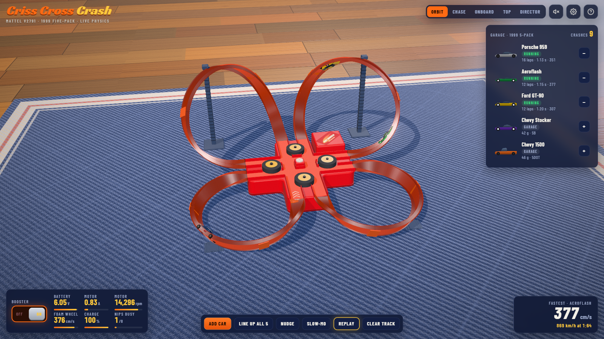
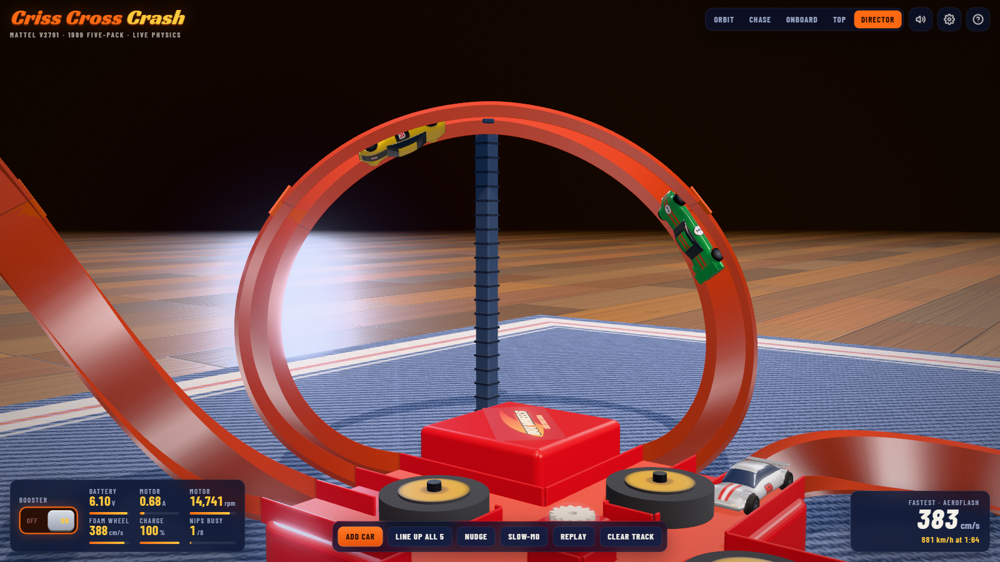
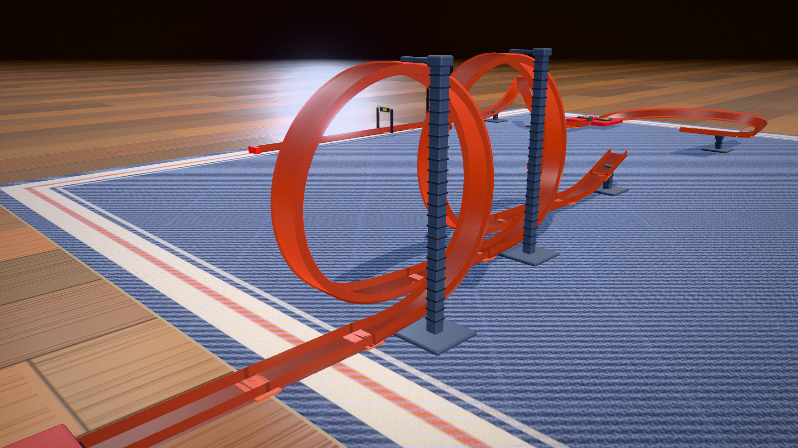
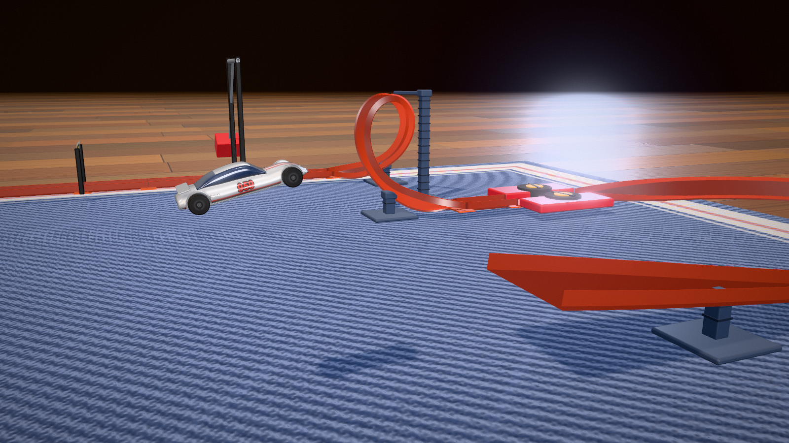
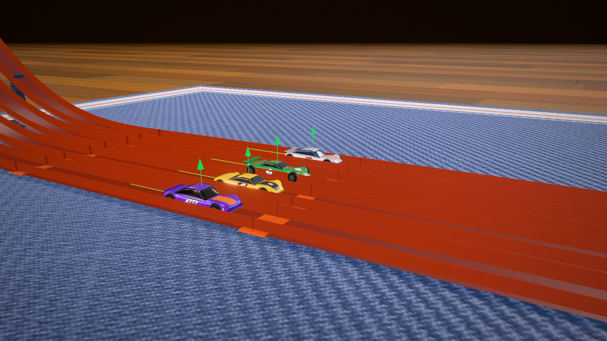
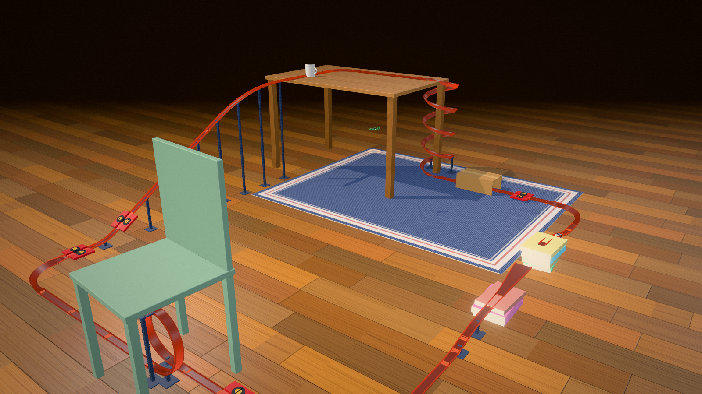
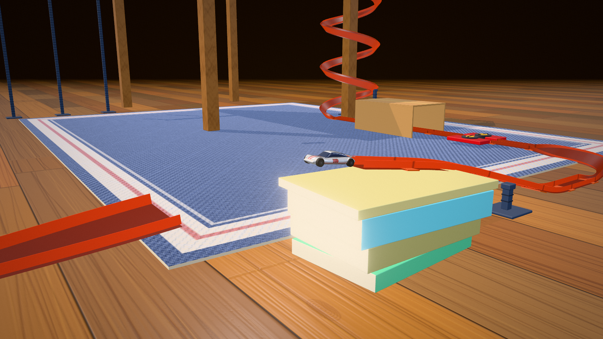
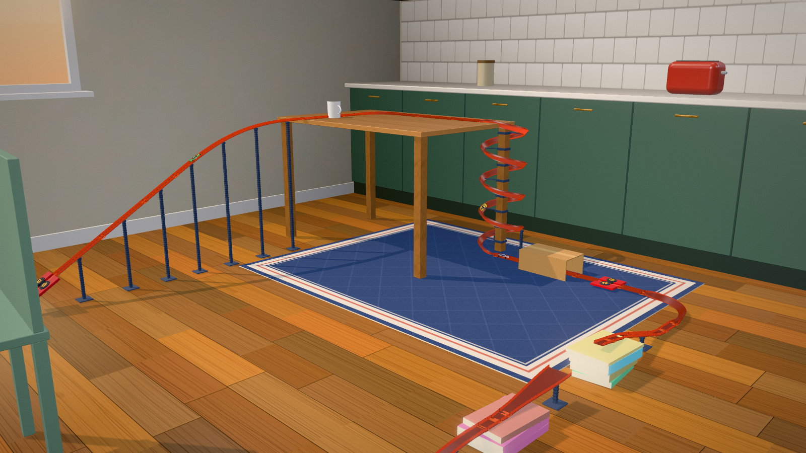
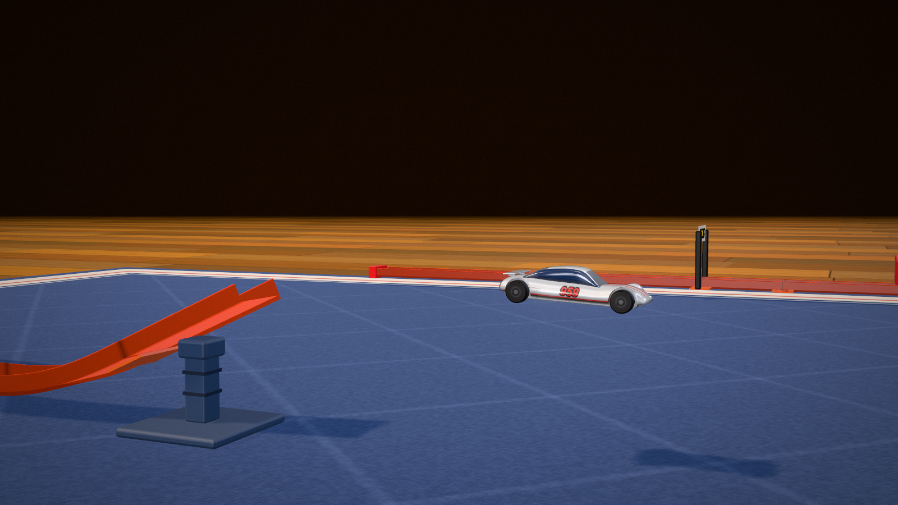
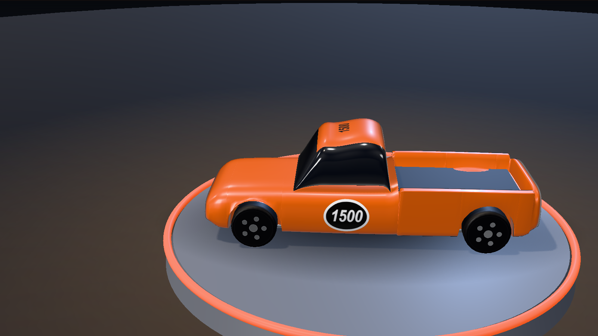

# Progress archive

One image per milestone, oldest first, so the build can be shown as a story later - on a GitHub
page, in a README, wherever. **Every session should add a frame when something visibly changes**
(see "Adding a frame" at the bottom). Keep it to one image per real step; this is a timeline, not
a screenshot dump. Working shots that are not milestones belong in `../screenshots/`.

Each entry says what the picture shows and, where it is known, what the sim could actually *do* at
that moment - because "it looks right" and "it works" came apart repeatedly on this project, and
the pairing is the interesting part.

---

### 00 - What we were building from
`../V2791-instructions.png` (and `V2791-half0.png` / `V2791-half1.png` for the two halves at full
resolution; zoom them with `tools/imgzoom.html`). These are Mattel's, so they stay on the
developer's disk and are not in the public repository.

Mattel's own instruction sheet for V2791. Not a render - the source. Its CONTENTS page is what
settled the architecture: **4 x one moulded ~270 deg arc** and **4 x one adjustable TRACK SUPPORT**,
which means all four lobes are the same part and only the tilt differs. The TO PLAY diagram shows
the two rear lobes standing up as rings and the two front ones low and wide. Everything from
frame 06 onward follows from reading that properly.

### 01 - First render
`01-2026-09-08-first-render.png` · commit `99a8c89` (T11)

The first time the thing looked like anything: hub, four lobes, track ribbons, lighting, camera
presets. The geometry here is the **original wrong model** - four identical banked 270° curves,
all the same shape, sitting nearly flat. Worth keeping precisely because it is wrong.

*Could it run?* Cars launched and left the track almost immediately.

### 02 - Gear train x-ray
`02-2026-09-08-gear-train-xray.jpg` · commit `99a8c89` (T11)

Motor pinion, idler and the four satellite gears driving the foam wheels, drawn in x-ray so the
drivetrain is visible through the hub. The electrical model behind it - battery internal
resistance, back-EMF, gear ratio, flywheel inertia - is real, not decorative.

### 03 - The five castings
`03-2026-09-08-five-castings.png` · commit `f0ac56f` (T12)

The 1999 five-pack, built as meshes with liveries painted onto canvas textures: Porsche 959,
Aeroflash, Ford GT-90, Chevy Stocker, Chevy 1500. 421 triangles each. Masses and dimensions are
per-casting and feed the physics.

### 04 - Control panel
`04-2026-09-08-control-panel.png` · commit `8ce8251` (T13)

Booster switch, car chips, live gauges (battery volts, motor amps, rpm, foam surface speed, car
speed, scale km/h) and the tuning drawer bound straight to `HW.config`.

### 05 - First crash
`05-2026-09-08-first-crash.jpg` · commit `99a8c89` (T11)

Two cars meeting at the `#` crossing, which is the entire point of the toy.

### 06 - Four flat lobes
`06-2026-09-08-four-flat-lobes.png` · commit `42a86ed` (T18)

After the lobes were re-derived as **tilted circles** - but with both tilts at 18°, because that
was the only setting that lapped at the time. Four near-identical teardrops. This is what the set
looked like when it was working best and looking least like the real thing.

*Could it run?* Lone car ~1.45 laps per 25 s over a 20-run ensemble, 5 % off-track.

### 07 - The real 2 + 2 shape
`07-2026-09-08-real-2plus2-shape.png` · commit `bab8e16` (T18)

The same layout at loop tilt 48° / sweep 16° - **two upright rings on their posts and two wide low
sweeps**, which is what the V2791 instruction sheet actually shows. Footprint 102 cm, ring apex
25.5 cm. Reproduce it any time from a cold load:

```
index.html#cfg=%7B%22loopTiltDeg%22%3A48%2C%22sweepTiltDeg%22%3A16%7D
```

*Could it run?* Barely - 0.13 laps per 25 s. It looked right and did not work, which is the whole
story of the middle of this project.

### 08 - Rings at 40°
`08-2026-09-09-rings-at-40deg.png` · commit `0ad5518` (T18)

The compromise that shipped: 40° rings, which read unmistakably as 2 + 2 and still lap. Getting
here needed `hubHalf` 13 → 16 (also more faithful - the photos scale the hub to ~32 cm across) and
a much shorter connector straight, because at high tilt the derived junction radius collapses.

*Could it run?* Selftest 8/8 in real Chrome; five-car pile-up producing crashes again.

### 09 - Published
`09-2026-09-10-published.png` · commit `3a6d290` (T19)

Ring apex 20.1 cm, sweep 8.6 cm, footprint 116 cm, after `rampPow` removed a 2.4 g curvature step
where the ramp leaves the flat hub. Published as a private Artifact, and it now **opens running** -
booster on, cars fed in one at a time.

*Could it run?* Lone car 0.75 mean laps (best 3), five-car pile-up 5–10 crashes with 4 of 5 cars
lapping. Confirmed by Stewart in a real browser: "worked but only for a lap or so."

---

### 10 - The lobes became loops
`10-2026-09-13-banked-loops.png` · (T23-T26)

The first frame where the track can actually hold a car. Until now every lobe was a **flat ribbon
lying in a tilted plane**, and such a surface supplies *zero* cornering force at any tilt: the
centre of the circle is in the plane, so the direction the car must be pushed lies in the plane,
and the surface normal is perpendicular to it. All 2.5-5.7 g went into the side wall, and the car
was not driving round the lobe, it was being dragged round it on its side - wheels off the ground
for 23-91 % of each lobe. Here the lobe surface is rolled toward the circle's centre, so it is a
banked channel (30 deg) heading toward a real loop, and the **floor** takes the corner. You can see
it: the ribbons roll over as they curve, where in frames 06-09 they were flat plates on edge.
The lobe radius is still 16 cm: it was raised to 19 and put back two days later, once T24 showed
that the n=30 single-offset-set measurement behind the change was the unreliable kind.

*Could it run?* Yes, for the first time. Measured at **n=120** over two independent sets of start
offsets, against the previous shipped geometry in the same batch:

| | now | before |
|---|---|---|
| runs that completed a lap | **61 %** | 31 % |
| runs that completed three | **25 %** | 1 % |
| mean laps per 25 s | 1.59 | 0.44 |
| runs that stalled out | 35 % | 66 % |

Wheels-off through the north ring went 23-47 % -> **0 %** and its drag 0.23-0.76 g -> 0.10-0.33 g.
The self-test's fleet check went from 2 of 5 cars lapping to 5 of 5, and five cars for 30 s from
3 crashes with everything stopped to **19 crashes and 13 laps, nothing lost off the table**. That
last one also needs the two game affordances added with it -- a stronger motor and auto-recycle --
because five loaded nips otherwise bog the motor below the speed a car needs to crest the ring.


### 11 - The arc got shorter, and everything got easier
`11-2026-09-13-sweep248.png` - (T27)

The lobes are the same idea as frame 10, but the moulded arc now sweeps **248 deg instead of 270**,
and the radius came down 16 -> 14 cm to match. That sounds cosmetic and is not. The junction turn
between the hub and each lobe -- the stretch that had been the most expensive on the circuit, taken
at the highest speed of the lap -- is *derived* from the arc's sweep, and going from 270 to 248
takes its radius from **20.5 cm to 33.9 cm**, cutting the cornering load there by a third. The
ring's apex came down too (20.1 -> 18.0 cm), and the lap length and footprint barely moved. Every
earlier geometry lever on this project traded the corner against the climb; this is the first that
did not.

*Could it run?* The self-test's five-car check hit **16 crashes in 15 seconds with none of the five
cars stalled and all of them still moving** -- against 5 crashes and 4 cars dead a few days earlier.
A lone car: 65 % of runs complete a lap and 26 % complete three, n=120 over two independent sets of
start offsets.


## 12 - 2026-09-24 - v2: the car rides the track, and it finally works



A rebuild from scratch (the v1 code is in `legacy/`). v1 made every car a free rigid body on a
mesh track and spent five sessions losing them to wall scrub and edge snagging. v2 constrains a
car to the track while it is in the channel: three coordinates (along, across, lift) in the
banked track frame, Newton's second law solved there every 0.5 ms, with the floor and walls only
able to push. It becomes a Rapier rigid body only when it leaves: a hard hit, falling off a loop
top, drifting out of a lane in the crossing. It is recaptured when it lands upright in a lane.

The lobes were redesigned too: each is two quintic-Hermite halves chosen to minimise bending
energy, and the bank is computed from the heartline rule (the track leans exactly into the
force a car at design speed needs), so the tall rear lobes are true loops that cars ride
upside down. Hub, cars, room, cameras, HUD and sound are all new.

*Could it run?* A lone car: 16 laps in 20 s with no stall and no derail, every casting, 1.11 to
1.21 s a lap (`node tools/simtest.mjs lone 20 N`). Two cars: 50 laps each in a minute, no
crash. Three: about ten crashes a minute. Five: a pile-up every second or so, which is what the
box promises.

## 13 - 2026-09-24 - over the top



The director's loop shot, live: the Ford GT-90 upside down across the top of the north-east
loop while the Aeroflash runs down its side. The floor stops pushing when v^2/R drops below g at
the apex; with tired batteries (tuning drawer) that is exactly where cars start falling off.

Screenshots for this archive are now taken with the Playwright MCP browser at 1600x900 (it uses
the real GPU, so they match what the page looks like), straight into `docs/progress/`.

## 14 - 2026-09-24 - sets as data: a double loop



The engine became a platform. A track set is now plain data (`src/35-sets.js`): a graph of
tracks, each a chain of snap-together pieces, closed into a circuit or open with ends that stop,
fly (a jump lip), link or split. Criss Cross Crash was rewritten as set #1 and reproduces the old
build **bit for bit** (`tools/regress.mjs` hashes every car's state twice a second on fixed
seeds). The loops here are exact helices eased in and out by quintics that match position,
tangent and curvature, each hung from a tower beside its apex.

*Could it run?* Drop & Jump, the proof set: 15 of 15 test drops land the jump and finish.

## 15 - 2026-09-24 - Loop & Leap: in the air



The stunt set: spring launcher, double loop, a kicker and a funnel catch across a gap, a
two-wheel booster, a corkscrew, a swinging hammer. The launcher throws car and plunger together
(v = x sqrt(k/(m + m_p))), so a light casting leaves faster than a heavy one. Off the lip the car
is a free rigid body that pivoted nose-down off the edge; it is caught only if it lands upright
and moving.

*Could it run?* A strength sweep of all five castings: below ~0.65 a car drops off a loop top,
~0.65-0.75 it falls short or crash-lands, 0.75-0.95 it lands and finishes, the top end sails over
(the light Aeroflash first, the heavy Stocker never).

## 16 - 2026-09-24 - Race Day, with the forces showing



A four-lane gravity drag strip with a start gate, a light tree and a timing gate. Nothing drives
the cars but gravity, so the differences the model already knew about decide it: rolling
resistance per wheel type, mass against frontal area, how straight a car runs. After each heat
a card says why the winner won, from the cars' energy ledgers ("lost 15.7% of its drop to axle
drag, the winner only 13.4%: its 5-Dot wheels roll easier"). The green arrows are the floor
force in car weights, the trails are coloured by speed.

*Could it run?* Stock, the 5-Dot cars win by 3-8 ms and the Saw Blade Stocker is last every
heat. With graphite wheels and two coins from the tuner, the Stocker wins every heat.

## 17 - 2026-09-24 - the Kitchen Table Grand Prix



Our own set, through the room: a hand start on a 75 cm kitchen table, a four-turn spiral down a
table leg, a cardboard-box tunnel, a booster, a jump between two stacks of books, a loop standing
under a chair, and a long boosted ramp back onto the table. The furniture is placed from the
track (the table's leg is the spiral's axis, the books prop the ramp up to its lowest point).
Between this frame and the Track Builder (codes like `#t.LSSOSJ.SlSBSFK`), every roadmap phase
is in.

*Could it run?* Unattended, three cars for two minutes: 63 jumps, 63 caught, 61 laps of about
5.1 s. The challenge (five cars, three laps each, none lost) depends on how you time the drops.

## 18 - 2026-09-24 - off the books



The Porsche leaving the lip on the first stack of books, the funnel on the second stack waiting,
the spiral and the box tunnel behind.

## 19 - 2026-09-25 - a kitchen, not a void



Overnight polish. The Kitchen Table Grand Prix now stands in a kitchen: plaster walls, a window
on the side the late sun comes from, green cabinets with brass handles, a tiled splashback and a
toaster. The sun's shadow box grows to fit each set (before, anything more than 58 cm from the
middle cast no shadow, so the chair and the ramp floated). The spiral is clipped to the table leg,
the chair loop hangs from the seat, and the book-jump catch stands on a tower at its mouth.

## 20 - 2026-09-25 - jumps are scored, and the Director watches them



Every jump is measured from the lip to the first touch: airtime, distance, height, landed or
not. The speedometer shows the last one and the set's best; a record, a huge one or a wipeout gets
a banner and a chime. In Director mode a car leaving a lip cuts to a side-on tracking shot in
slow motion (at most one every 7 s), and Replay frames the last jump. Here the Porsche is 0.2 s
out of the Loop & Leap kicker.

## 21 - 2026-09-25 - the Showroom



V (or the garage's Showroom button) puts one casting on a turning plinth in a small studio:
its card (what the real toy is, the numbers the physics uses), what it did this session, and the
tuner. The Track Builder also gained Merge back (splitter branches come round again), hammer and
paddle-wheel pieces, and a launcher strength that rides in the code.

## 22 - 2026-09-26 - Lukewarm Wheels: a title screen
`22-2026-09-26-title-screen.jpg`

v1. The project gets a parody name and a front door: the title screen opens over the running
set (the Director camera as an attract mode), with a card per set and six featured tracks built
in the Track Builder, each with a thumbnail taken from the running sim. Behind it: 27 trophies,
photo mode, rooms closed on all four sides.

*Could it run?* Everything it could before, bit for bit (`tools/regress.mjs` identical).

## 23 - 2026-09-26 - shipped
`23-2026-09-26-landing-page.png`

The landing page at https://lukewarm-wheels.pages.dev, the sim at `/play/`. Every clip on it was
filmed from the sim by `tools/film.mjs` on a virtual clock at 60 fps.

## Adding a frame

WebGL canvases cannot be screenshotted from Node, and `toDataURL` returns an empty image once the
compositor has run, so the picture has to be read out of the GL buffer in the same tick as the
render. `tools/serve.mjs` accepts the result at `POST /__shot?name=…` and writes it to
`docs/screenshots/`; move it here if it is a milestone.

With `node tools/serve.mjs` running, open the page and run this in the browser console (or through
a browser tool's JS evaluation):

```js
const r = HW.render, gl = r.renderer.getContext();
r.renderer.setSize(1280, 720, false);
r.camera.aspect = 1280 / 720; r.camera.updateProjectionMatrix();
r.setCamera('overview');
r.renderer.render(r.scene, r.camera);
const w = gl.drawingBufferWidth, h = gl.drawingBufferHeight, px = new Uint8Array(w * h * 4);
gl.readPixels(0, 0, w, h, gl.RGBA, gl.UNSIGNED_BYTE, px);
const cv = document.createElement('canvas'); cv.width = w; cv.height = h;
const ctx = cv.getContext('2d'), img = ctx.createImageData(w, h);
for (let y = 0; y < h; y++) {                 // GL's origin is bottom-left
  const s = (h - 1 - y) * w * 4;
  img.data.set(px.subarray(s, s + w * 4), y * w * 4);
}
ctx.putImageData(img, 0, 0);
await fetch('/__shot?name=10-YYYY-MM-DD-slug.png', { method: 'POST', body: cv.toDataURL('image/png') });
```

Then add an entry above: what changed, the commit, and what the sim could do at that point.
`node tools/ens.mjs '{"secs":25,"backs":[0,0.07,0.19,0.4],"cases":{}}'` gives the "could it run"
line - never quote a single run, which on this project is noise.
